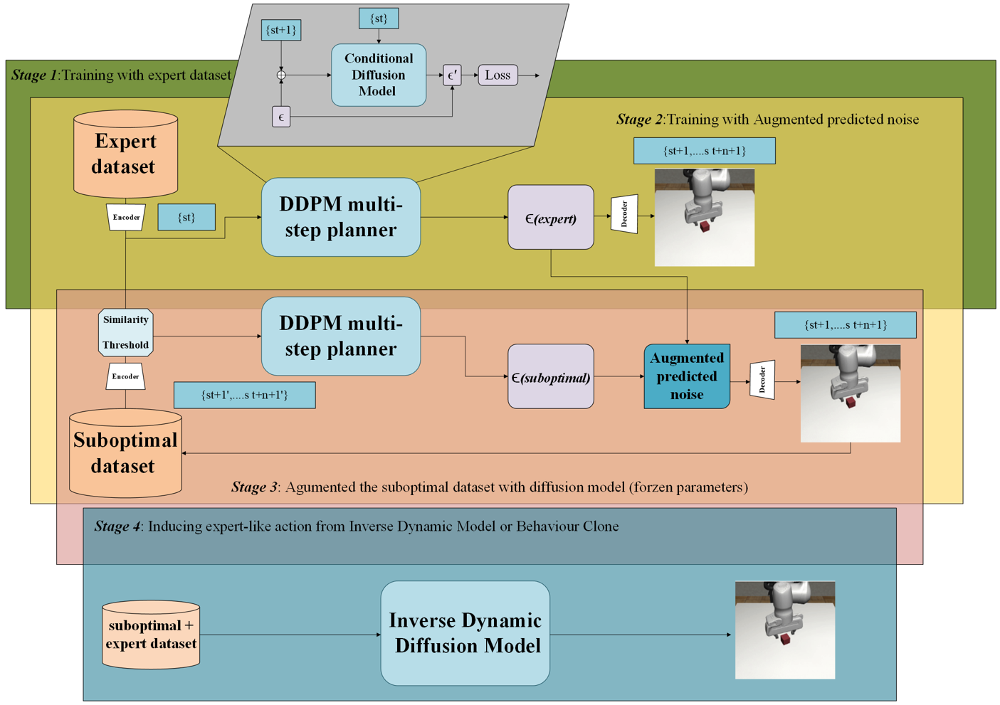
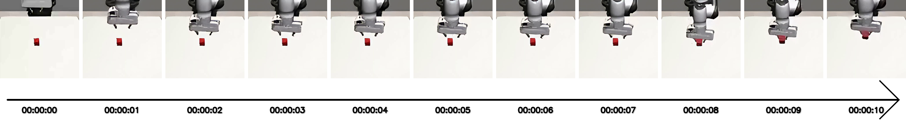

# Diffusion Dagger

## Method


## Installation (you might need to upgrade the robosuite into the lastest version)
create conda environment:

```
conda env create -f env.yml
pip install --upgrade "jax[cuda12_pip]==0.4.26" -f https://storage.googleapis.com/jax-releases/jax_cuda_releases.html
```

Download the [Robomimic Dataset](https://robomimic.github.io/docs/datasets/robomimic_v0.1.html) and re-render observations at 64x64. Make sure the robosuite version is consistent across dataset generation and policy evaluation.


## Data Collection (We only tested the lift cube, but feel free to try out other tasks as well !)
To collect suboptimal data, first train a noisy imitation learning agent, and then collect rollouts. e.g. failed rollouts from a policy we are evaluating. (We recommend using only 3 trails from the robomimic dataset, the outcome policy obtain from behaviour clone will have a success rate about 20% for lift cube).
```
python3 train_bc.py experiment_folder=FOLDER experiment_name=NAME data=cfg/rm_lift/img n_grad_steps=1000 save_every_step=1000 warmup_steps=10

python3 collect_data.py experiment_folder=FOLDER experiment_name=NAME folder_tag=1 eval_tag=test ckpt=1000 n_eval_episodes=500 save_path=PATH_TO_SAVE data.env_params.env_kwargs.lowdim_obs=[robot0_eef_pos,robot0_eef_quat,robot0_gripper_qpos,object]
```


## Training a VAE encoder 
To train the variational autoencoder:
```
python3 train_vae.py experiment_folder=VAE_FOLDER experiment_name=VAE_NAME data=cfg/rm_lift/mixed_img
``` 


## Processing dataset into latent space though VAE encoder (You might need to overwite the path within in the .yaml file)
```
python3 process_sdvae_data.py experiment_folder=FOLDER experiment_name=NAME data=cfg/rm_lift/img data.train_path=DATA_PATH restore_snapshot_path=PATH_TO_VAE_CKPT
```
To train the expert diffusion model, run `train_bc.py`. (You will need to set the correct expert dataset path in train_bc.yaml).
To run the diffusion dagger, run train_bc.py`.(You will need to set the correct suboptimal dataset path in train_bc.yaml, also make sure "is_dagger = True")
To train the IDM with mixed batches , instead run `train_mixed_bc.py`. You will need to set the paths to the data and the generated latents from the script above. Additionally, ensure that the min/max bounds for the latent representations are accurate.

```
python3 train_bc.py experiment_folder=FOLDER experiment_name=NAME agent=ldp_agent data=cfg/rm_lift/latent_img  agent.vae_pretrain_path=PATH_TO_VAE_CHECKPOINT data.meta.obs_normalization.obs.latent_agentview_image.min=-10 data.meta.obs_normalization.obs.latent_agentview_image.max=10 horizon= ? action_horizon= ? -cn train_mixed_bc_rm_lift

python3 train_mixed_bc.py experiment_folder=FOLDER experiment_name=NAME agent=ldp_agent data=cfg/rm_lift/latent_img  agent.vae_pretrain_path=PATH_TO_VAE_CHECKPOINT data.meta.obs_normalization.obs.latent_agentview_image.min=-10 data.meta.obs_normalization.obs.latent_agentview_image.max=10 horizon=? action_horizon= ? -cn train_mixed_bc_rm_lift
```


## Citation
We are giving full credits to the paper "Latent Diffusion Planning for Imitation Learning", Huge thanks to their wonderful works. 
```
@misc{xie2025latentdiffusionplanningimitation,
      title={Latent Diffusion Planning for Imitation Learning}, 
      author={Amber Xie and Oleh Rybkin and Dorsa Sadigh and Chelsea Finn},
      year={2025},
      eprint={2504.16925},
      archivePrefix={arXiv},
      primaryClass={cs.RO},
      url={https://arxiv.org/abs/2504.16925}, 
}
```
